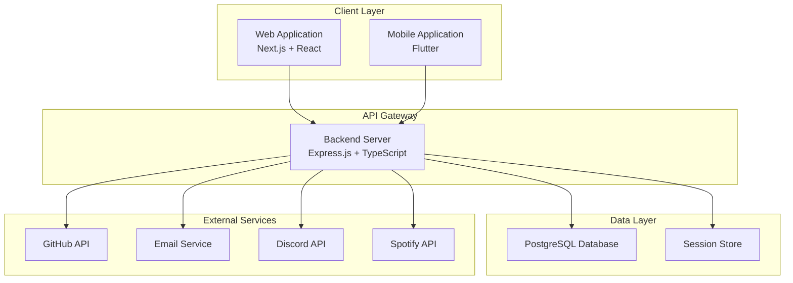
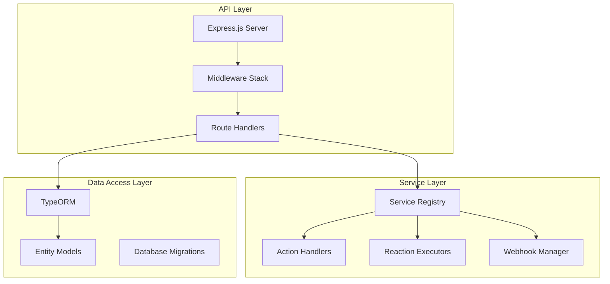
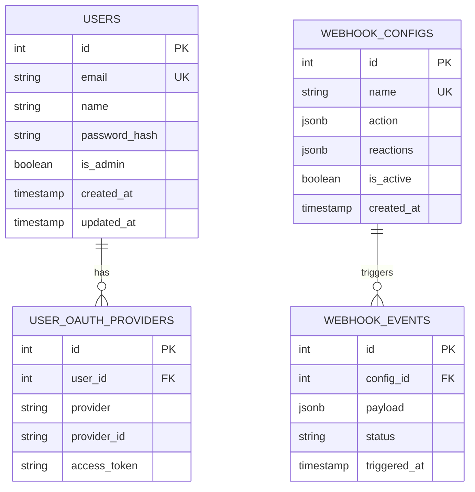
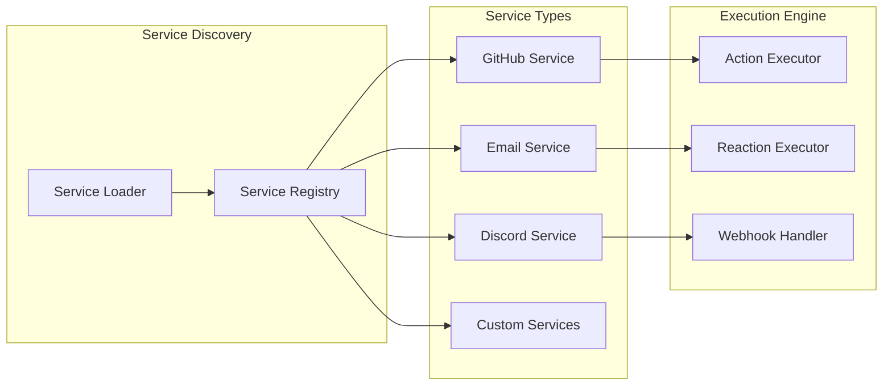
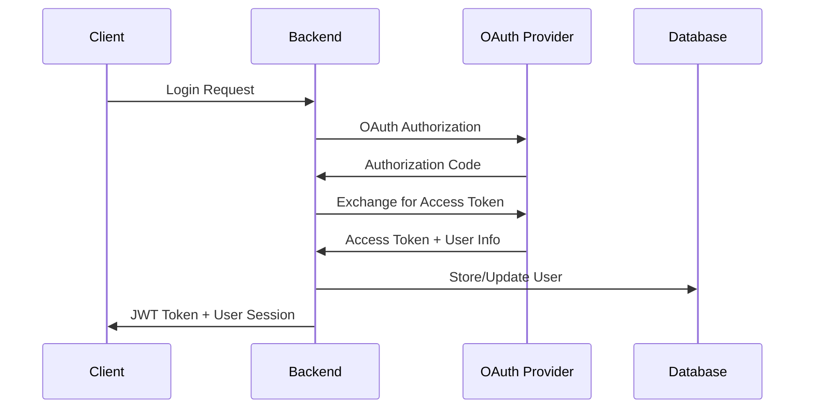
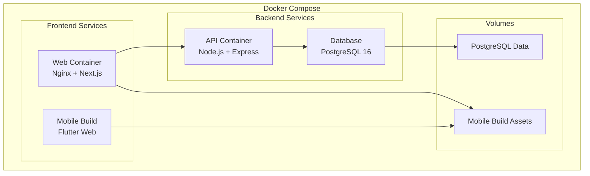
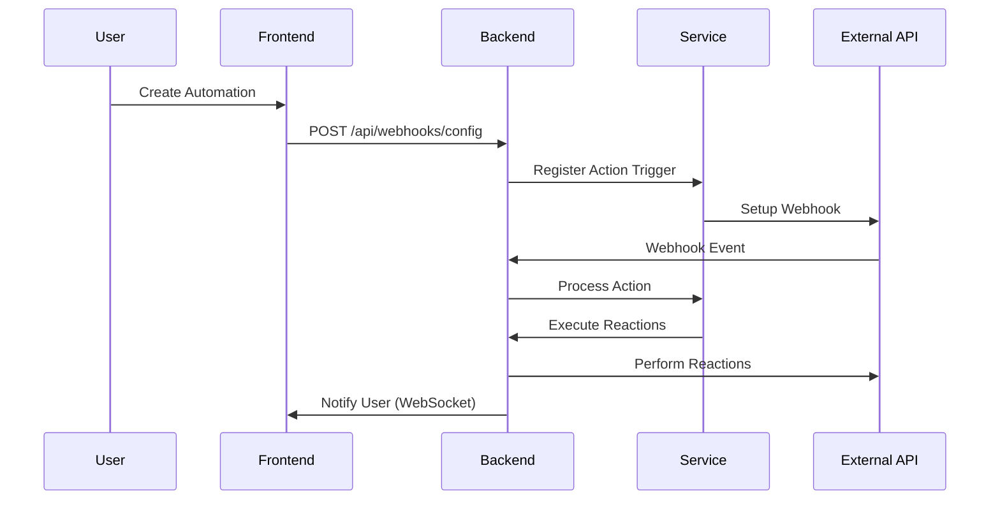
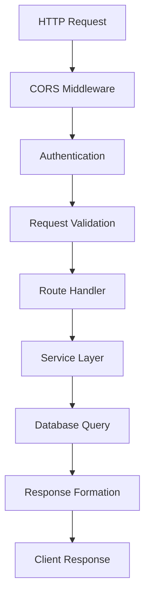

# Project Architecture

## Overview

The AREA (Action - REAction) platform is built using a modern, microservices-oriented architecture that enables seamless automation between different services. The platform consists of three main components working together to provide a comprehensive automation solution.

## High-Level Architecture

## System Components

### 1. Frontend Applications

#### Web Application (`/web`)
- **Technology**: Next.js 15 with React 19
- **Styling**: Tailwind CSS with custom design system
- **State Management**: React Context API
- **Authentication**: JWT tokens with HTTP-only cookies
- **Features**:
  - Responsive design for desktop and tablet
  - Real-time automation management
  - Service configuration interface
  - User dashboard and analytics
  - Internationalization support

#### Mobile Application (`/mobile`)
- **Technology**: Flutter 3.9+ with Dart
- **State Management**: Provider pattern
- **Navigation**: GoRouter for declarative routing
- **Features**:
  - Cross-platform (iOS/Android)
  - Native look and feel
  - Offline capability
  - Push notifications
  - Biometric authentication

### 2. Backend Server (`/backend`)

#### Core Architecture

#### Key Components

**Express.js Server** (`/backend/index.ts`)
- Main application entry point
- Middleware configuration (CORS, authentication, sessions)
- Route registration and API versioning
- Error handling and logging

**Service Architecture** (`/backend/src/services/`)
- **ServiceRegistry**: Central registry for all available services
- **ServiceLoader**: Dynamic service loading from filesystem
- **ReactionExecutorRegistry**: Manages reaction execution logic
- **ExecutionService**: Orchestrates automation workflows

**Route Structure** (`/backend/src/routes/`)
- `/auth` - Authentication and user management
- `/user` - User profile and settings
- `/api` - General API endpoints
- `/about` - System information and service discovery
- `/webhooks` - Webhook handling for external triggers
- `/github` - GitHub-specific integrations
- `/services` - Service configuration endpoints

**Database Layer** (`/backend/src/config/`)
- TypeORM configuration and entity management
- Database connection handling
- Migration and seeding utilities

### 3. Database Architecture (`/database`)

#### Schema Design

#### Table Categories
- **User Management**: `users`, `user_oauth_providers`, `user_tokens`
- **Automation**: `webhook_configs`, `webhook_events`, `webhook_reactions`
- **System**: `user_activity_logs`, `webhook_stats`, `webhook_failures`

### 4. Service Integration Layer

#### Service Registry Pattern

#### Service Structure
Each service implements:
- **Actions**: Trigger conditions (e.g., "new GitHub commit")
- **Reactions**: Response actions (e.g., "send email notification")
- **Configuration Schema**: User-configurable parameters
- **OAuth Integration**: Authentication with external services
- **Webhook Support**: Real-time event handling

### 5. Authentication & Authorization

#### Authentication Flow

#### Security Features
- **JWT Tokens**: Stateless authentication with secure HTTP-only cookies
- **OAuth Integration**: GitHub, Discord, Spotify, and more
- **Session Management**: Secure session storage with automatic cleanup
- **Rate Limiting**: API rate limiting and abuse prevention
- **CORS Configuration**: Secure cross-origin request handling

### 6. Deployment Architecture

#### Docker Containerization

#### Environment Configuration
- **Development**: Local development with hot reload
- **Production**: Optimized builds with environment-specific configs
- **Docker**: Containerized deployment with orchestration
- **CI/CD**: Automated testing and deployment pipelines

## Data Flow Architecture

### Automation Workflow

### API Request Flow

## Technology Stack

### Frontend Technologies
- **Next.js 15**: React framework with server-side rendering
- **React 19**: Modern React with hooks and context
- **TypeScript**: Type-safe JavaScript development
- **Tailwind CSS**: Utility-first CSS framework
- **Flutter**: Cross-platform mobile development
- **Dart**: Programming language for Flutter

### Backend Technologies
- **Node.js**: JavaScript runtime environment
- **Express.js**: Web application framework
- **TypeScript**: Typed JavaScript for better development
- **TypeORM**: Object-relational mapping for TypeScript
- **Passport.js**: Authentication middleware
- **JWT**: JSON Web Tokens for authentication

### Database & Storage
- **PostgreSQL**: Primary relational database
- **Redis**: Session storage and caching (optional)
- **TypeORM**: Database abstraction and migrations

### DevOps & Deployment
- **Docker**: Containerization platform
- **Docker Compose**: Multi-container orchestration
- **GitHub Actions**: CI/CD pipeline automation
- **ESLint**: Code quality and consistency
- **Prettier**: Code formatting
- **Jest**: Testing framework

## Security Architecture

### Data Protection
- **Encryption**: All sensitive data encrypted at rest and in transit
- **Input Validation**: Comprehensive input sanitization and validation
- **SQL Injection Prevention**: Parameterized queries and ORM protection
- **XSS Protection**: Content Security Policy and output encoding

### Authentication Security
- **Multi-Factor Authentication**: Optional 2FA support
- **Session Security**: Secure session management with automatic expiration
- **OAuth Security**: Secure third-party authentication flows
- **Token Security**: JWT tokens with secure signing and validation

### API Security
- **Rate Limiting**: Request throttling and abuse prevention
- **CORS Policy**: Strict cross-origin resource sharing
- **API Versioning**: Backward-compatible API evolution
- **Audit Logging**: Comprehensive activity logging and monitoring

## Performance & Scalability

### Backend Optimization
- **Connection Pooling**: Database connection optimization
- **Query Optimization**: Efficient database queries and indexing
- **Caching Strategy**: Redis-based caching for frequently accessed data
- **Async Processing**: Non-blocking I/O operations

### Frontend Optimization
- **Code Splitting**: Dynamic imports and lazy loading
- **Image Optimization**: Next.js image optimization
- **Bundle Optimization**: Tree shaking and minification
- **CDN Integration**: Static asset delivery optimization

### Mobile Optimization
- **App Size**: Minimized APK/IPA sizes
- **Performance**: Optimized Flutter widgets and state management
- **Network**: Efficient API calls with caching
- **Battery**: Optimized background processing

## Monitoring & Observability

### Logging Strategy
- **Structured Logging**: JSON-formatted logs with correlation IDs
- **Log Levels**: Appropriate log levels for different environments
- **Centralized Logging**: Aggregated logs for monitoring and debugging

### Health Monitoring
- **Health Checks**: Endpoint monitoring for service availability
- **Database Monitoring**: Connection and query performance tracking
- **Error Tracking**: Comprehensive error logging and alerting

### Analytics
- **User Analytics**: Usage patterns and feature adoption
- **Performance Metrics**: Response times and throughput monitoring
- **Business Metrics**: Automation success rates and user engagement

This architecture provides a solid foundation for the AREA platform, ensuring scalability, maintainability, and security while delivering a seamless user experience across web and mobile platforms.
